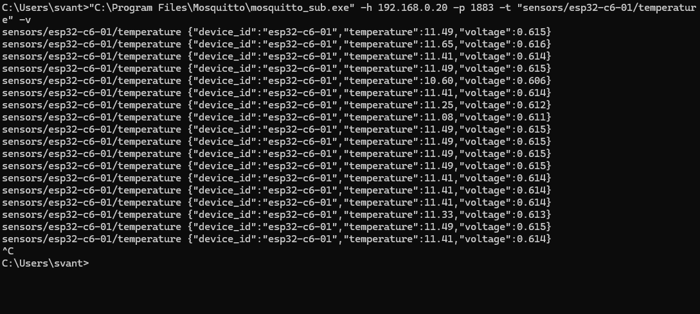
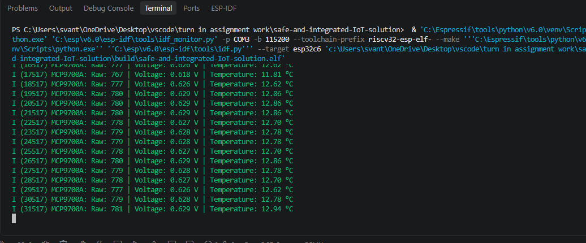
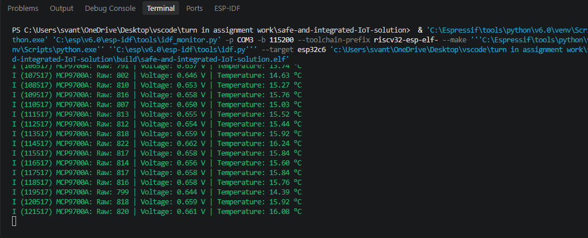
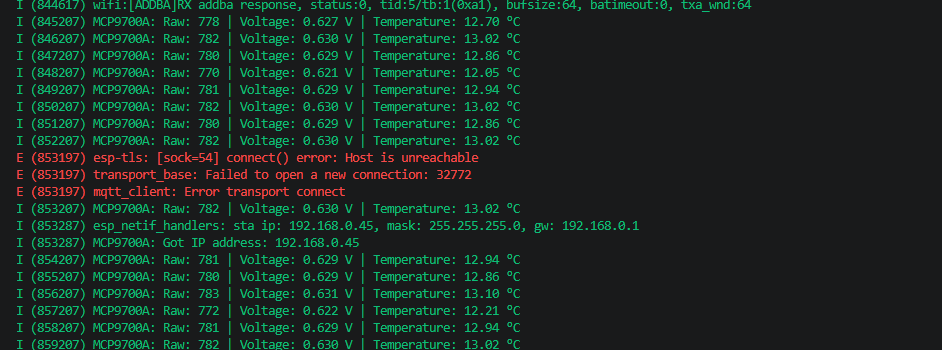
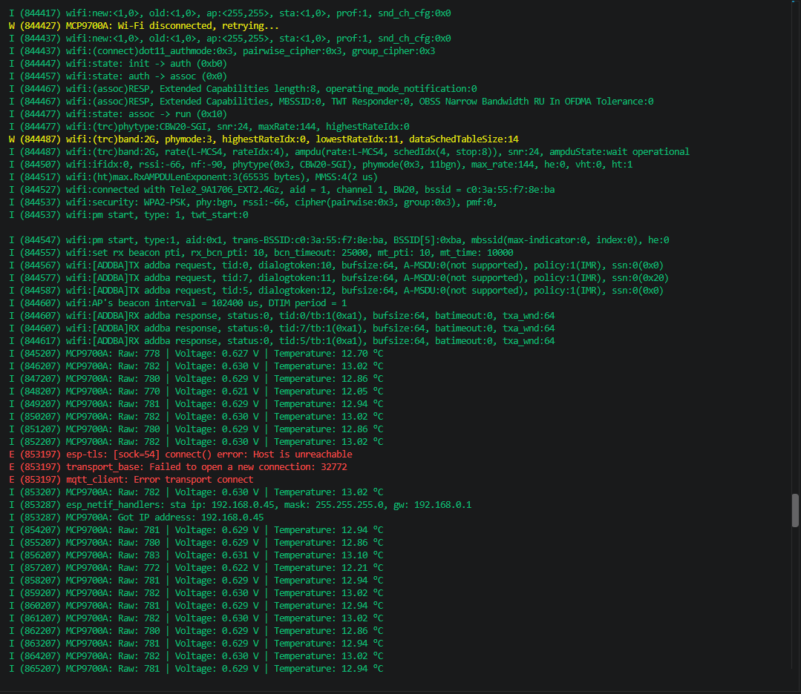
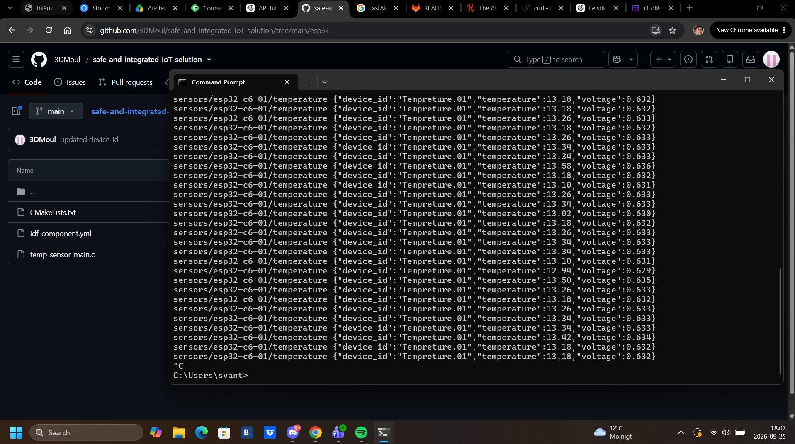
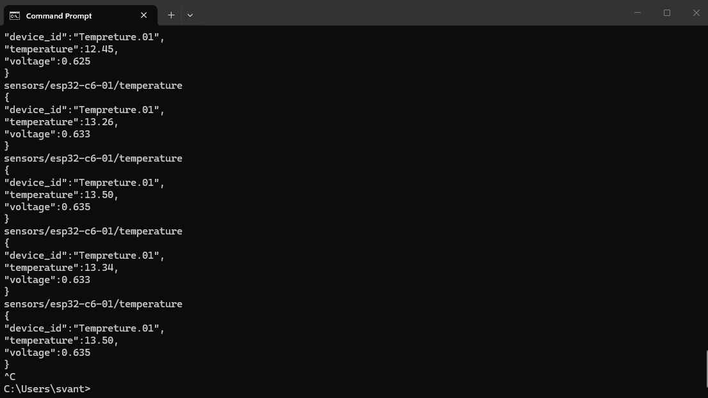

## Introduction

This assignment presents a safe and integrated IoT solution, focusing on how connected devices can work together while protecting data, systems, and users. It explores practical design considerations for building a reliable, secure, and effective IoT environment.

Networkcommunication
---
broker: Mosquitto
ip address: 192.168.0.20
Port: 1883
Protokoll: MQTT
Topic: sensors/esp32-c6-01/temperature
Modell: Publish/Subscribe
--
wifi
Wi-Fi-namn (SSID): in wifisecrets.h
Wi-Fi-lösenord: in wifisecrets.h
--
harware
---
microcontroller
model: ESP32-C6
--
sensor
model: mcp9700e/a
unit: tempreture(C)
range: (-50 C) to (50 C)
note:: check with multimeter to se if you get right output

TESTS
------

--//Test the MQTT connection//--
i put this in the cmd terminal
-- "C:\Program Files\Mosquitto\mosquitto_sub.exe" -h 192.168.0.20 -p 1883 -t "sensors/esp32-c6-01/temperature" -v --

it prints out exactly how i want it

---

--//Test that the sensor responds to temperature changes//--
I start the program let it go for a while then i start blowing hot air towards the sensor
normal

blowing hot air

---

--//Test Wi-Fi recovery//--
Here i disable the internet acces and then turn it on
disabled

enabled

---

--//Test MQTT from another machine//--
this is from my laptop

---

--//Check the JSON//--
looking at how the JSON payload looks like 
it should look like this:
<!-- sensors/esp32-c6-01/temperature
{
"device_id":"Tempreture.01",
"temperature":13.50,
"voltage":0.635
} -->

it looks like this

---