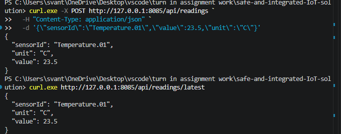
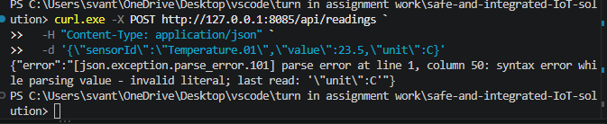

## Introduction

This assignment presents a safe and integrated IoT solution, focusing on how connected devices can work together while protecting data, systems, and users. It explores practical design considerations for building a reliable, secure, and effective IoT environment.
----////////////////////////////////////////////////////////////----

--///////////////////////////--
--//  startup instructions //--
--///////////////////////////--
------
--//network setup//--
Wi-Fi SSID
-your wifi
Wi-Fi password
-your wifi password

Creat a header called wifisecrets.h in esp32 folder and put in your wifi and password there. and put in this 
#define WIFI_SSID "YourWiFi"
#define WIFI_PASSWORD "YourPassword"

Mosquitto IP
-your IP

The MQTT broker IP must match the IPv4 address of the computer running Mosquitto. Update the IP in both the ESP32 firmware and the C++ backend so they can connect to the same broker.
to find IP in powershell write
|-
ipconfig
|-

MQTT port
-1883

API address	
-127.0.0.1:8085

--//software requirements//--
ESP-IDF installed and configured for ESP32-C6.
Mosquitto installed as a Windows service.
MSYS2 UCRT64 with g++, the Mosquitto development library, and the JSON dependencies.
---

Check if Mosquitto is running
|-
Get-Service -Name mosquitto
|-

If Mosquitto is not running open up adminastrator powershell and write this
|-
Start-Service -Name mosquitto
|-
---
terminal 1:
Start with build and flash to the esp this should open up monitoring for the esp code
This command will compile the esp32 firmware, upload the firmware to your esp32c6 and then display esp32 
|-
cd esp32
idf.py build flash monitor
|-
---
terminal 2:
compile backend
|-
g++ backend/api.cpp backend/mqtt_subscriber.cpp backend/json_reading.cpp `
  -Ibackend `
  -I/ucrt64/include `
  -L/ucrt64/lib `
  -lmosquitto `
  -lws2_32 `
  -pthread `
  -o backend/backend.exe
|-

to start backend functions like api and mqtt subscriber this can be done form the project root directory write this.
|-
.\backend\backend.exe
|-
---
terminal 3:
to check for api latest reading and health

for health
|-
curl.exe http://127.0.0.1:8085/health 
|-

for latest reading 
|-
curl.exe http://127.0.0.1:8085/api/readings/latest 
|-

----////////////////////////////////////////////////////////////----

--///////////////////////////--
--//      Background       //--
--///////////////////////////--

--// visual representation of the project code //--
safe-and-integrated-IoT-solution/
│
├── esp32/
│   ├── main/
│   │   └── ... ESP32 firmware code
│   └── wifisecrets.h
│
├── backend/
│   ├── api.cpp
│   ├── mqtt_subscriber.cpp
│   ├── mqtt_subscriber.hpp
│   ├── json_reading.cpp
│   ├── json_reading.hpp
│   ├── httplib.h
│   ├── nlohmann/
│
└── README.md
--// visual representation of the code in effect //--

MCP9700A Temperature Sensor
          |
          | Analog voltage
          v
       ESP32-C6
          |
          | Reads ADC
          | Calculates temperature
          | Creates JSON
          |
          | Wi-Fi / MQTT
          v
    Mosquitto Broker
    192.168.0.20:1883
          |
          | MQTT subscription
          v
   mqtt_subscriber.cpp
          |
          | Receives JSON payload
          v
    json_reading.cpp
          |
          | Parses and validates JSON
          v
    Latest valid reading
    (Shared backend state)
          |
          | Accessed by api.cpp
          v
        REST API
    127.0.0.1:8085
          |
          | HTTP GET
          v
       API Client
    (curl / browser)

--///////////////////////////--
--// Network communication //--
--///////////////////////////--
------

broker: Mosquitto
ip address: 192.168.0.20
Port: 1883
Protocol: MQTT
Topic: sensors/esp32-c6-01/temperature
Modell: Publish/Subscribe

The ESP32-C6 publishes temperature readings as JSON messages to the Mosquitto MQTT broker. The C++ backend subscribes to the temperature topic and receives the messages through the broker.

----////////////////////////////////////////////////////////////----

--///////////////////--
--// JSON/XML data //--
--///////////////////--
------
--//Why i choose JSON//--
I chose JSON because it is lightweight, easy to read, and supported by both the ESP32 firmware and the C++ backend. It allows the sensor reading to be sent in a structured format over MQTT.(and i personaly think it looks better).
XML was not used because JSON was sufficient for the project's sensor data. JSON also requires less formatting for this simple message structure.(and i get scared when i see XML).

--//JSON formating//--

{
"sensorId":"Temperature.01",
"value":13.5,
"unit":"C"
}

sensorId: Identifies the sensor and wants a non-empty string.
value: Temperature reading and wants a JSON number.
unit: Temperature unit is just "C" its the unit of measurment.

--//validation of JSON readings//--

the validation happens in the backend in json_reading.cpp with the parse_reading() function it checks:

- The message is a valid JSON object.
- sensorId is a non-empty string.
- value is a JSON number between -50 and 100.
- unit is exactly "C".

If a JSON message is invalid, the backend logs an error and rejects the reading. The invalid reading is not stored, and the latest valid reading remains unchanged.

----////////////////////////////////////////////////////////////----

--///////////////////--
--//      API      //--
--///////////////////--
------

GET /health
curl.exe http://127.0.0.1:8085/health

this endpoint is checking if the api is running. if it is runnning it outputs "ok". 

GET /api/readings/latest
curl.exe http://127.0.0.1:8085/api/readings/latest

this endpoint takes and gives you the latest reading stored in the backend/api. it returns "200 ok" if there is one and "404" for not foud.

POST /api/readings	
curl.exe -X POST http://127.0.0.1:8085/api/readings `
  -H "Content-Type: application/json" `
  -d '{\"sensorId\":\"Temperature.01\",\"value\":23.5,\"unit\":\"C\"}'

This is to send a reading manualy

this is a valid JSON reading

here is a reading created

Invalid JSON syntax

here there is and error because i removed a random " so it could not be parsed and the reading is not created

Invalid field value or type

here there is and error because i used a string instead of a JSON number for value that was expected and the reading is not created

----////////////////////////////////////////////////////////////----

--///////////////////--
--//   Security    //--
--///////////////////--
------

--//validation of JSON readings//--
the validation happens in the backend in json_reading.cpp with the parse_reading() function it checks:

- The message is a valid JSON object.
- sensorId is a non-empty string.
- value is a JSON number between -50 and 100.
- unit is exactly "C".

If a JSON message is invalid, the backend logs an error and rejects the reading. The invalid reading is not stored, and the latest valid reading remains unchanged.

--//REST API access//--
The REST API uses 127.0.0.1:8085, which means it can only be accessed from the computer running the backend. This reduces the risk of other devices on the network accessing the API directly. However, the API does not have authentication.

--//The use of header file for wifi//--
I store my Wi-Fi SSID and password in a separate header file called wifisecrets.h. This file is ignored by Git and is not uploaded to GitHub, preventing my Wi-Fi credentials from being shared publicly.

--//MQTT security limitations//--
My MQTT broker uses port 1883 without TLS encryption. This means the MQTT messages are sent without encryption. If the broker allows unauthenticated clients, another device on the network could potentially subscribe to messages or publish fake readings. A future improvement would be to add MQTT authentication and TLS encryption.

----////////////////////////////////////////////////////////////----

--////////////////////////////////--
--//    Logging & monitoring    //--
--////////////////////////////////--
------
--//ESP32 logging//--

I use the ESP-IDF serial monitor to see what is happening on my ESP32-C6. The monitor shows when the ESP32 connects to Wi-Fi and receives an IP address. It also prints the raw ADC reading, calculated voltage, and temperature from the MCP9700A sensor. This helps me check that the sensor is working and updating its readings. I can also use the monitor to identify connection problems or errors.

----////////////////////////////////////////////////////////////----

--///////////////////--
--//     Wi-Fi     //--
--///////////////////--
------

Wi-Fi name (SSID): in wifisecrets.h
Wi-Fi password: in wifisecrets.h

--//Wi-Fi connection//--
The ESP32-C6 uses the Wi-Fi name (SSID) and password stored in wifisecrets.h. When Wi-Fi starts, the WIFI_EVENT_STA_START event triggers esp_wifi_connect() to connect to the network. Once connected and assigned an IP address, IP_EVENT_STA_GOT_IP is triggered. The program then sets WIFI_CONNECTED_BIT, allowing the program to continue with MQTT and sensor readings.

--//Wi-Fi recovery//--
If the Wi-Fi connection is lost, WIFI_EVENT_STA_DISCONNECTED is triggered this happens automatically by the ESP32-C6 Wi-Fi system. The program automatically calls esp_wifi_connect() to attempt reconnection. This allows the ESP32-C6 to reconnect without restarting the device.

----////////////////////////////////////////////////////////////----

--///////////////////--
--//    hardware    //--
--///////////////////--
------

--//microcontroller//--
model: ESP32-C6

---

--//sensor//--
model: MCP9700E/A
unit: temperature(C)
range: (-50 C) to (100 C)
note: check with multimeter to se if you get right output

----////////////////////////////////////////////////////////////----

--/////////////////--
--//    TESTS    //--
--/////////////////--
------

--//Test the MQTT connection//--

I put this in the command terminal
--|| "C:\Program Files\Mosquitto\mosquitto_sub.exe" -h 192.168.0.20 -p 1883 -t "sensors/esp32-c6-01/temperature" -v ||--

it prints out exactly how i want it

---

--//Test that the sensor responds to temperature changes//--

I start the program and let it run for a while, then I blow hot air toward the sensor
Normal:

Blowing hot air

---

--//Test Wi-Fi recovery//--

Here i disable the internet acces and then turn it on
disabled:

enabled:

---

--//Test MQTT from another machine//--

this is from my laptop and the program is on my stationary:

---

--//Check the JSON//--

looking at how the JSON payload looks like 
it should look like this:

Topic: sensors/esp32-c6-01/temperature
Payload:
{
"device_id": "Temperature.01",
"temperature": 13.50,
"voltage": 0.635
}

it looks like this

//this is only for the testing this is not the final JSON formating
---

--//Testing that parse_reading() and serialize_reading() works//--

#include "json_reading.hpp"
#include <iostream>

int main() {
    Reading reading = parse_reading(
        R"({"sensorId":"sensor-1","value":23.5,"unit":"C"})"
    );

    std::cout << serialize_reading(reading) << '\n';
}

this code is a placeholder just to test the functions

I used this command to compile and make into exe --|| g++ main.cpp json_reading.cpp -I. -o app.exe ||--
Then i ran the exe with this command --|| .\app.exe ||--                                                  
It gave the expected output.
{                                                                                                             
    "sensorId":"sensor-1",                                                                                                      
    "value": 23.5,
    "unit": "C"            
}

---
--//    Deliberate error test    //--

    1. MQTT connection failure
    Ran  -| Stop-Service -Name mosquitto |- in Administrator PowerShell its start sending signals that it cant connect and it stops sending new readings to the api/backend
    
    Here i ran  -| start-Service -Name mosquitto |- in Administrator PowerShell it starts working again like normal
    

    - Expected result: What did you expect the ESP32 and backend to do when the broker stopped?
    -- Answer: i expected that the esp32 can still read the temperature sensor. And it will still try to publish MQTT messages. but without Mosquitto it will not be able to deliver those messages to the broker.

    - Reason: Why did stopping Mosquitto interrupt communication?
    -- Answer: Mosquitto is a middleman between the esp32 and the backend. so when i stopped Mosquitto there was no way for the readings to get to the backend.

    - Recovery: Did the ESP32 and backend reconnect automatically when you restarted Mosquitto, or did you need to restart either program? 
    -- Answer: the ESP32 and backend reconnect automatically and i did not have to restart the program.
    
    2. Invalid JSON syntax test
    I send and intentionaly wrong reading
    -|  
        & "C:\Program Files\Mosquitto\mosquitto_pub.exe" `
        -h 192.168.0.20 `
        -p 1883 `
        -t "sensors/esp32-c6-01/temperature" `
        -m '{"sensorId":"Temperature.01","value":"NOT_A_NUMBER","unit":"C"}'
    |-
    

    - Did the backend print Invalid sensor data or another error?
    -- Answer: the backend printed this error {sensorId:Temperature.01,value:NOT_A_NUMBER,unit:C}
                                            Invalid sensor data: [json.exception.parse_error.101] parse error at line 1, column 2: syntax error while parsing object key - invalid literal; last read: '{s'; expected string literal
    - Why is "NOT_A_NUMBER" invalid for the value field?
    -- Answer: Because the missing quotation marks makes the message invalid. and even if it was valid it would get a error because its expecting a number not a string.
    - Did the backend continue running after receiving the invalid message?
    -- Answer: Yes
    - Did valid readings from the ESP32 continue arriving afterward?
    -- Answer: Yes
    - Was the invalid value prevented from replacing the latest valid reading?
    -- Answer: Yes

--//

----////////////////////////////////////////////////////////////----