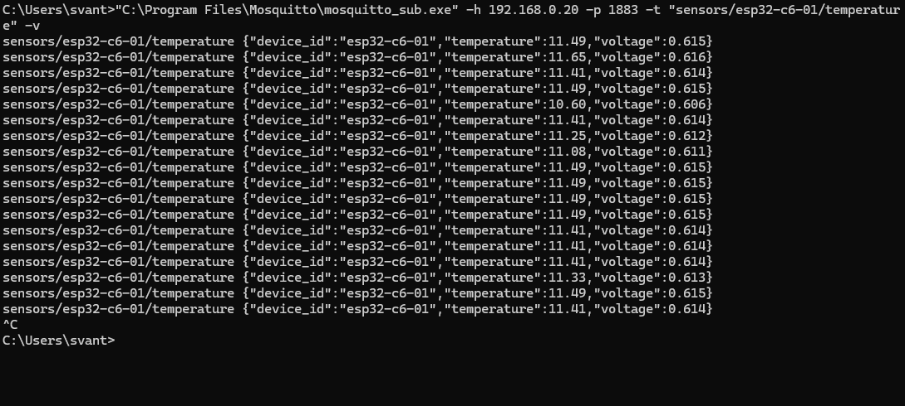
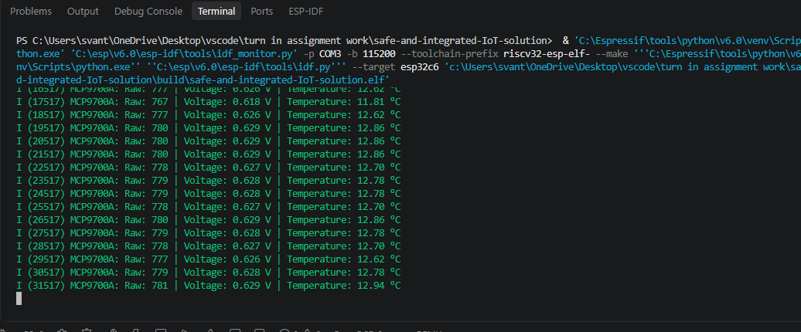
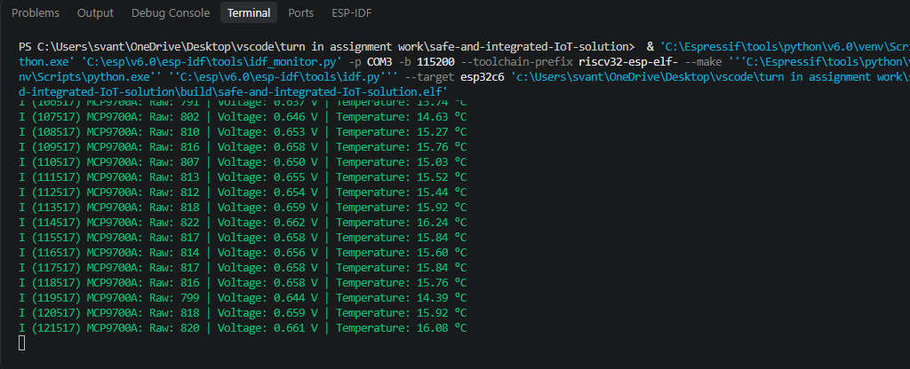
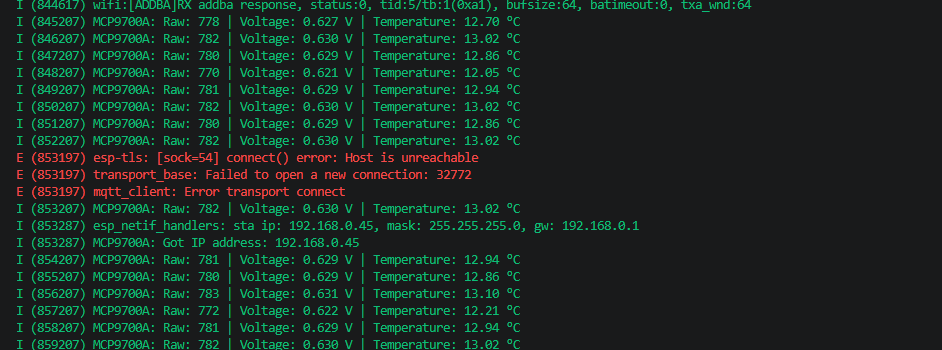
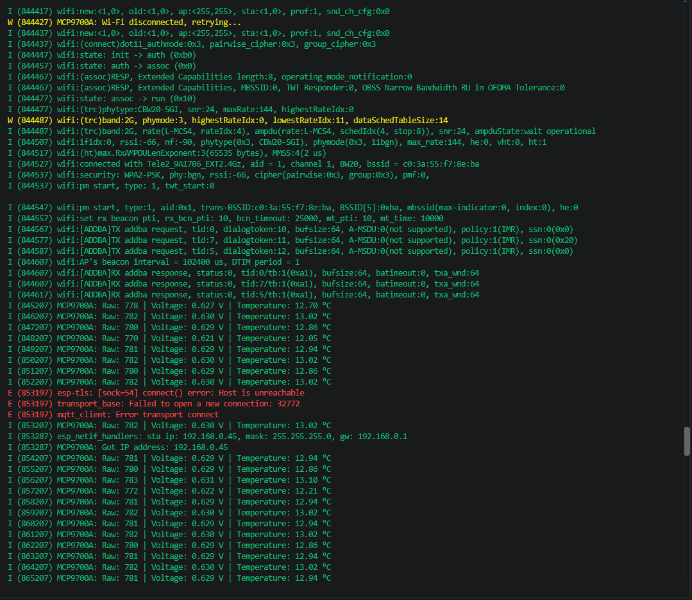
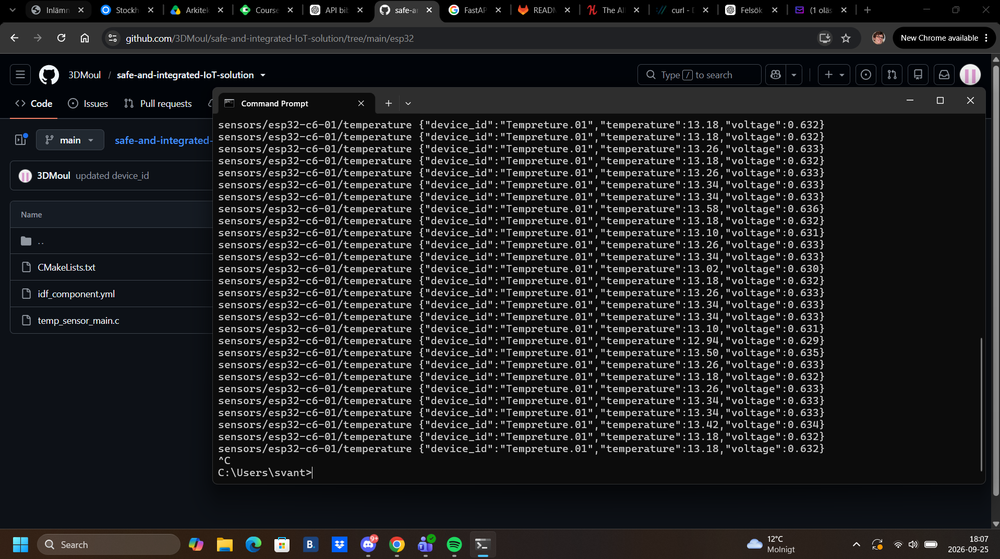
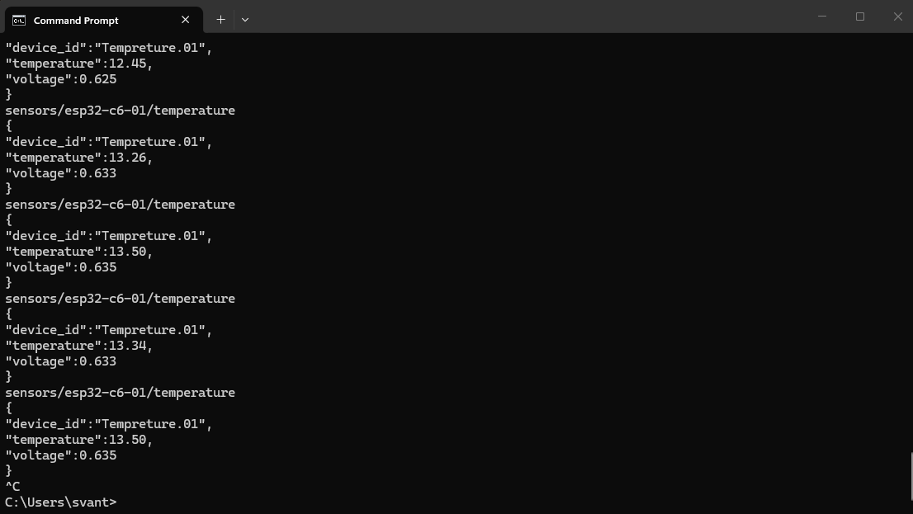
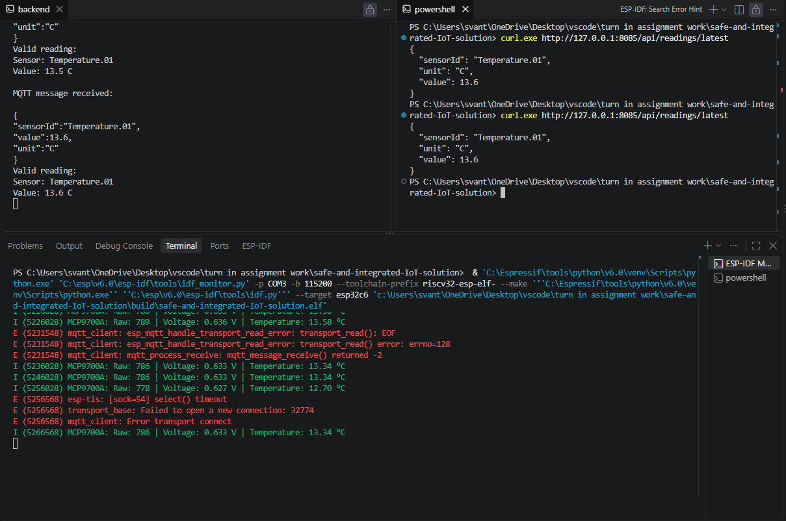
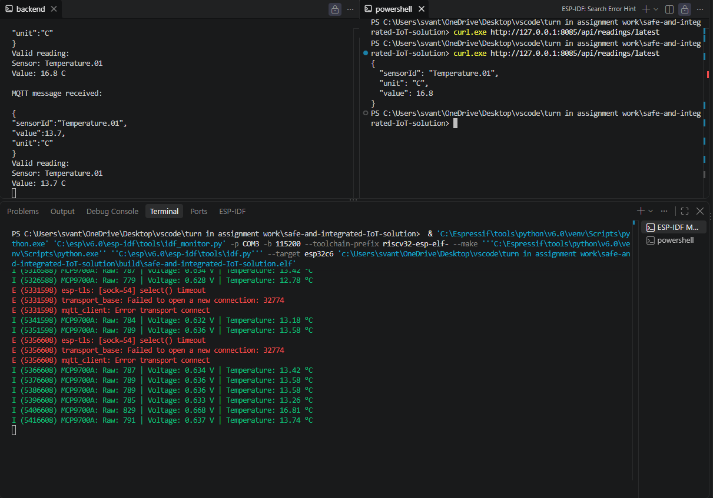
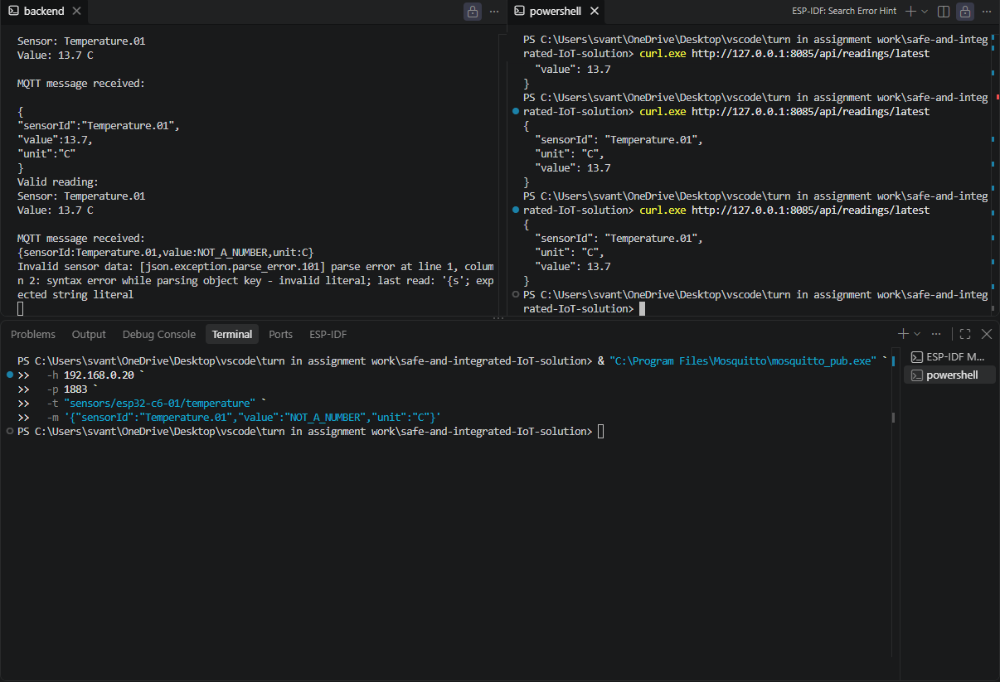

## Introduction

This assignment presents a safe and integrated IoT solution, focusing on how connected devices can work together while protecting data, systems, and users. It explores practical design considerations for building a reliable, secure, and effective IoT environment.
----////////////////////////////////////////////////////////////----

--///////////////////////////--
--//      Background       //--
--///////////////////////////--

--// visual representation of the project code //--
safe-and-integrated-IoT-solution/
│
├── esp32/
│   ├── main/
│   │   └── ... ESP32 firmware code
│   └── wifisecrets.h
│
├── backend/
│   ├── api.cpp
│   ├── mqtt_subscriber.cpp
│   ├── mqtt_subscriber.hpp
│   ├── json_reading.cpp
│   ├── json_reading.hpp
│   ├── httplib.h
│   ├── nlohmann/
│
└── README.md
--// visual representation of the code in effect //--

MCP9700A Temperature Sensor
          |
          | Analog voltage
          v
       ESP32-C6
          |
          | Reads ADC
          | Calculates temperature
          | Creates JSON
          |
          | Wi-Fi / MQTT
          v
    Mosquitto Broker
    192.168.0.20:1883
          |
          | MQTT subscription
          v
   mqtt_subscriber.cpp
          |
          | Receives JSON payload
          v
    json_reading.cpp
          |
          | Parses and validates JSON
          v
    Latest valid reading
    (Shared backend state)
          |
          | Accessed by api.cpp
          v
        REST API
    127.0.0.1:8085
          |
          | HTTP GET
          v
       API Client
    (curl / browser)

--//JSON formating//--

{
"sensorId":"Temperature.01",
"value":13.5,
"unit":"C"
}

--///////////////////////////--
--// Network communication //--
--///////////////////////////--
------

broker: Mosquitto
ip address: 192.168.0.20
Port: 1883
Protocol: MQTT
Topic: sensors/esp32-c6-01/temperature
Modell: Publish/Subscribe

----////////////////////////////////////////////////////////////----

--///////////////////--
--// JSON/XML data //--
--///////////////////--
------

----////////////////////////////////////////////////////////////----

--///////////////////--
--//      API      //--
--///////////////////--
------

----////////////////////////////////////////////////////////////----

--///////////////////--
--//   Security    //--
--///////////////////--
------

----////////////////////////////////////////////////////////////----

--////////////////////////////////--
--//    Logging & monitoring    //--
--////////////////////////////////--
------

----////////////////////////////////////////////////////////////----

--///////////////////--
--//     Wi-Fi     //--
--///////////////////--
------

Wi-Fi name (SSID): in wifisecrets.h
Wi-Fi password: in wifisecrets.h

----////////////////////////////////////////////////////////////----

--///////////////////--
--//    hardware    //--
--///////////////////--
------

--//microcontroller//--
model: ESP32-C6

---

--//sensor//--
model: MCP9700E/A
unit: temperature(C)
range: (-50 C) to (50 C)
note: check with multimeter to se if you get right output

----////////////////////////////////////////////////////////////----

--/////////////////--
--//    TESTS    //--
--/////////////////--
------

--//Test the MQTT connection//--

I put this in the command terminal
--|| "C:\Program Files\Mosquitto\mosquitto_sub.exe" -h 192.168.0.20 -p 1883 -t "sensors/esp32-c6-01/temperature" -v ||--

it prints out exactly how i want it

---

--//Test that the sensor responds to temperature changes//--

I start the program and let it run for a while, then I blow hot air toward the sensor
Normal:

Blowing hot air

---

--//Test Wi-Fi recovery//--

Here i disable the internet acces and then turn it on
disabled:

enabled:

---

--//Test MQTT from another machine//--

this is from my laptop and the program is on my stationary:

---

--//Check the JSON//--

looking at how the JSON payload looks like 
it should look like this:

Topic: sensors/esp32-c6-01/temperature
Payload:
{
"device_id": "Temperature.01",
"temperature": 13.50,
"voltage": 0.635
}

it looks like this

---

--//Testing that parse_reading() and serialize_reading() works//--

#include "json_reading.hpp"
#include <iostream>

int main() {
    Reading reading = parse_reading(
        R"({"sensorId":"sensor-1","value":23.5,"unit":"C"})"
    );

    std::cout << serialize_reading(reading) << '\n';
}

this code is a placeholder just to test the functions

I used this command to compile and make into exe --|| g++ main.cpp json_reading.cpp -I. -o app.exe ||--
Then i ran the exe with this command --|| .\app.exe ||--                                                  
It gave the expected output.
{                                                                                                             
    "sensorId":"sensor-1",                                                                                                         
    "value": 23.5
    "unit": "C",            
}

---
--//    Deliberate error test    //--

    1. MQTT connection failure
    Ran  -| Stop-Service -Name mosquitto |- in Administrator PowerShell its start sending signals that it cant connect and it stops sending new readings to the api/backend
    
    Here i ran  -| start-Service -Name mosquitto |- in Administrator PowerShell it starts working again like normal
    

    - Expected result: What did you expect the ESP32 and backend to do when the broker stopped?
    -- Answer: i expected that the esp32 can still read the temperature sensor. And it will still try to publish MQTT messages. but without Mosquitto it will not be able to deliver those messages to the broker.

    - Reason: Why did stopping Mosquitto interrupt communication?
    -- Answer: Mosquitto is a middleman between the esp32 and the backend. so when i stopped Mosquitto there was no way for the readings to get to the backend.

    - Recovery: Did the ESP32 and backend reconnect automatically when you restarted Mosquitto, or did you need to restart either program? 
    -- Answer: the ESP32 and backend reconnect automatically and i did not have to restart the program.
    
    2. Invalid JSON syntax test
    I send and intentionaly wrong reading
    -|  
        & "C:\Program Files\Mosquitto\mosquitto_pub.exe" `
        -h 192.168.0.20 `
        -p 1883 `
        -t "sensors/esp32-c6-01/temperature" `
        -m '{"sensorId":"Temperature.01","value":"NOT_A_NUMBER","unit":"C"}'
    |-
    

    - Did the backend print Invalid sensor data or another error?
    -- Answer: the backend printed this error {sensorId:Temperature.01,value:NOT_A_NUMBER,unit:C}
                                            Invalid sensor data: [json.exception.parse_error.101] parse error at line 1, column 2: syntax error while parsing object key - invalid literal; last read: '{s'; expected string literal
    - Why is "NOT_A_NUMBER" invalid for the value field?
    -- Answer: Because the missing quotation marks makes the message invalid. and even if it was valid it would get a error because its expecting a number not a string.
    - Did the backend continue running after receiving the invalid message?
    -- Answer: Yes
    - Did valid readings from the ESP32 continue arriving afterward?
    -- Answer: Yes
    - Was the invalid value prevented from replacing the latest valid reading?
    -- Answer: Yes

--//

----////////////////////////////////////////////////////////////----